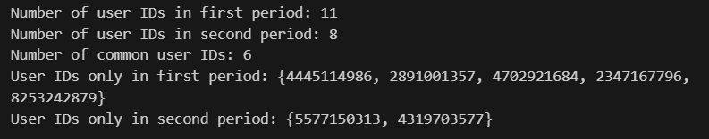
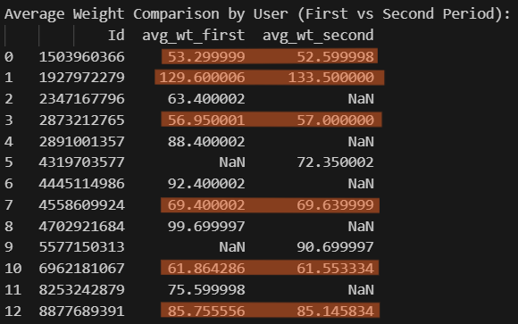

## Checking consistency for users before merging data for both months.

# WeightLogInfo

Checked the **unique number of users** for both datasets before merging.
Found that there are some users common in both datasets. It will be interesting to see their fitness journey (2 months).

While there are 5 and 2 unique users in first and second month respectively, let's see user's avg_weight for both months.

Noted that there no significant change in user's avg_weight between 2 months. So, decided to include all data of weight log, from both datasets, regardless of incomplete information and varied log timings by users.
